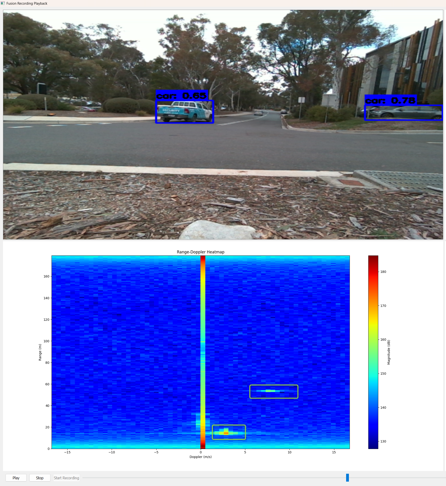
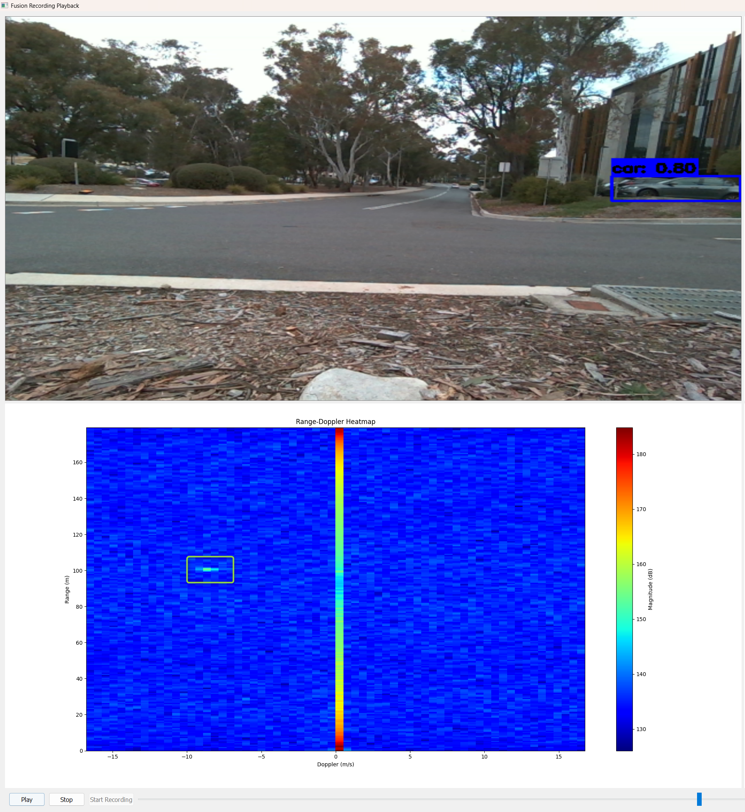
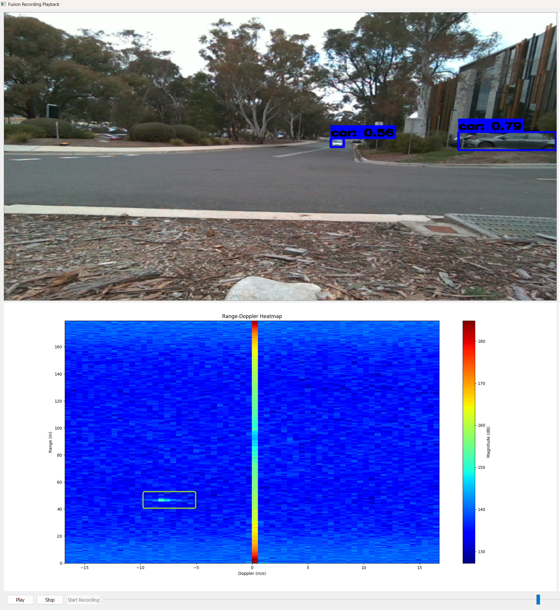
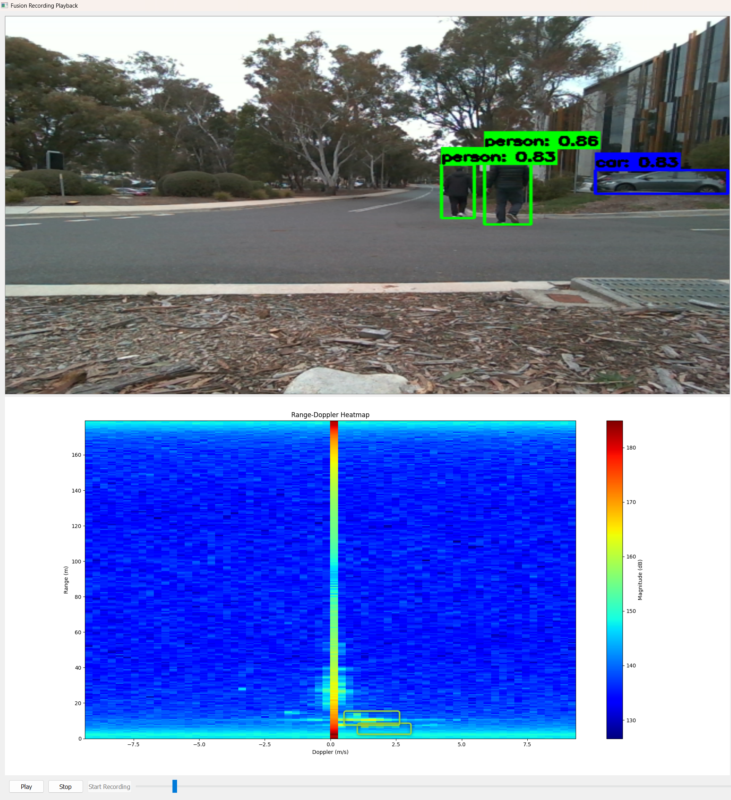
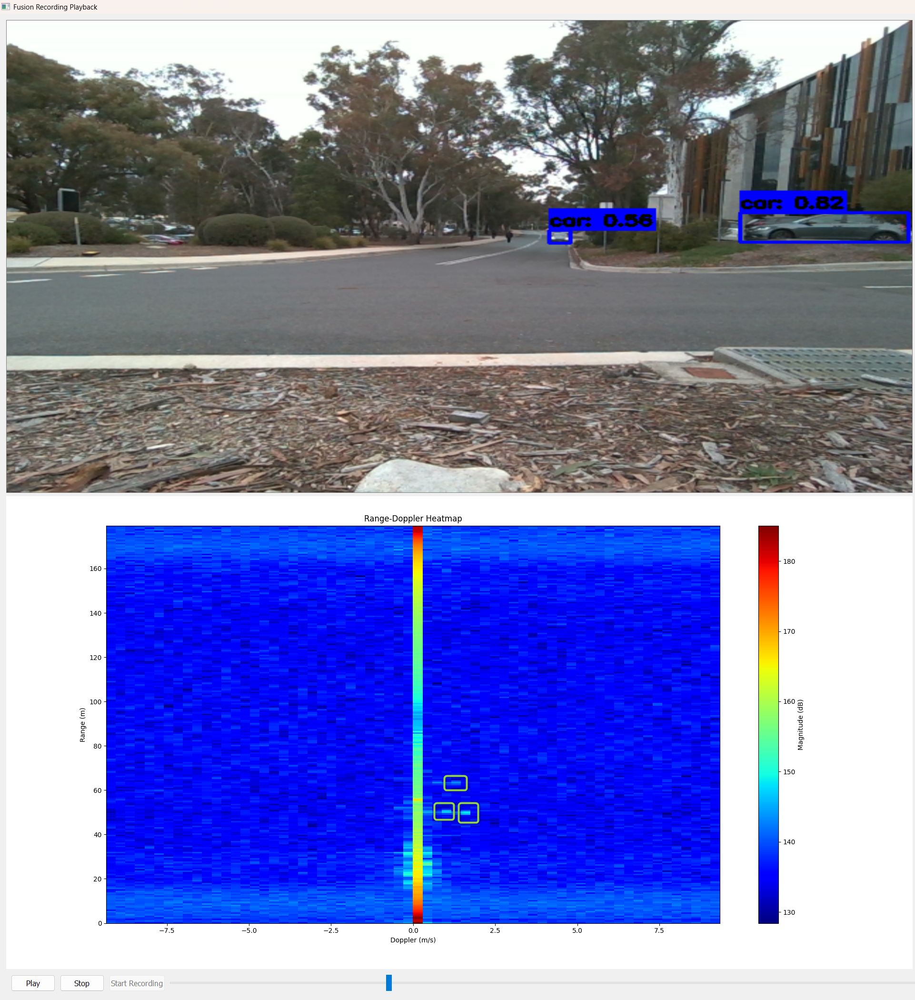
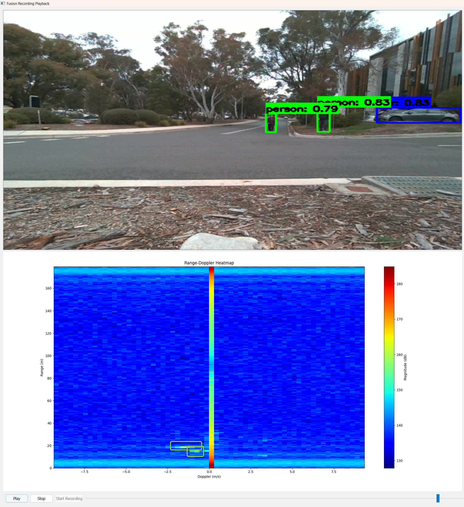

# Road Safety on Two Wheelers - FusionApp

## Overview
This application provides real-time object detection for road safety, specifically designed for two-wheeled vehicles. The system can detect cars, persons, and other objects to enhance rider safety.

## Sample Results

### Car Detection

    

        
        
Car detection in daylight conditions

    

    

        
        
Car detection with multiple vehicles

    

    

        
        
Car detection at night

    

### Person Detection

    

        
        
Single pedestrian detection

    

    

        
        
Multiple pedestrians crossing

    

    

        
        
Person detection in low-light conditions

    

## Features
- Real-time object detection for cars and pedestrians
- Works in various lighting conditions
- Alert system for potential collisions
- Compact sensing box design for two-wheeled vehicles

## Installation
[Add your installation instructions here]

## Usage
[Add your usage instructions here]
