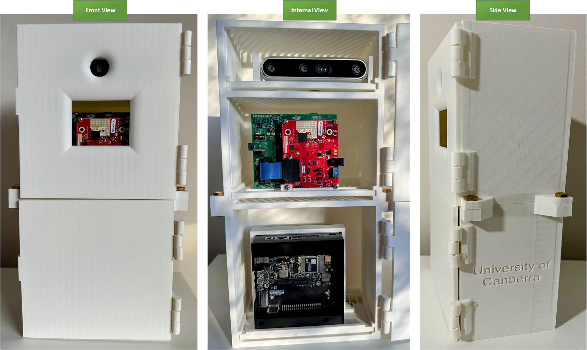

# Road Safety on Two Wheelers - FusionApp

## Overview
This application provides real-time object detection for road safety, specifically designed for two-wheeled vehicles. The system can detect cars, persons, and other objects to enhance rider safety.

## Sample Results

### Car Detection
|  |  |  |
|:---:|:---:|:---:|

### Person Detection
|  |  |  |
|:---:|:---:|:---:|

## Features
- Real-time object detection for cars and pedestrians
- Works in various lighting conditions
- Alert system for potential collisions
- Compact sensing box design for two-wheeled vehicles

## Installation
[Add your installation instructions here]

## Usage
[Add your usage instructions here]
