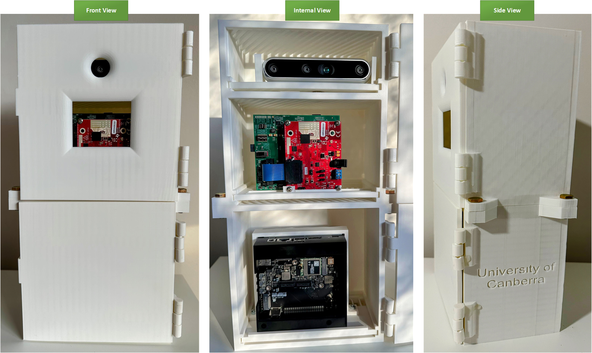
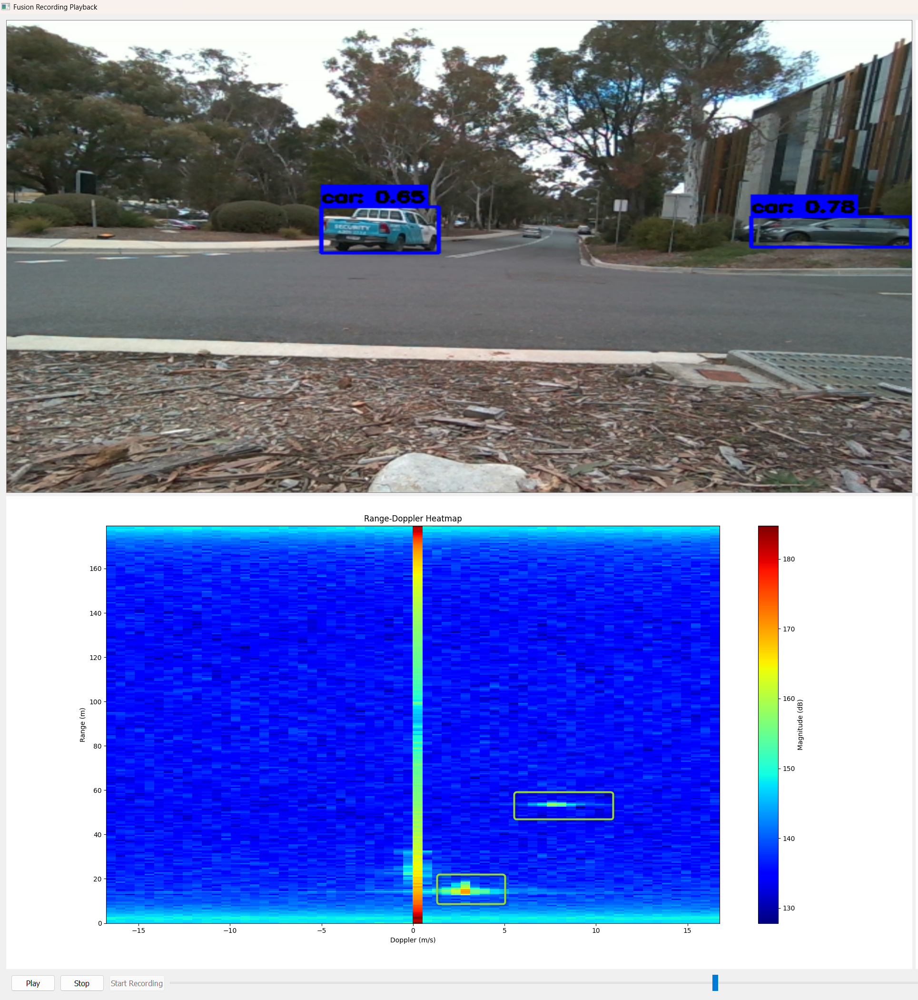
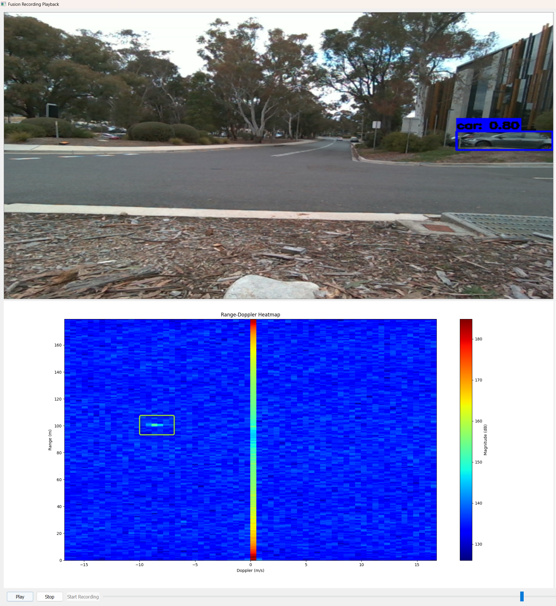
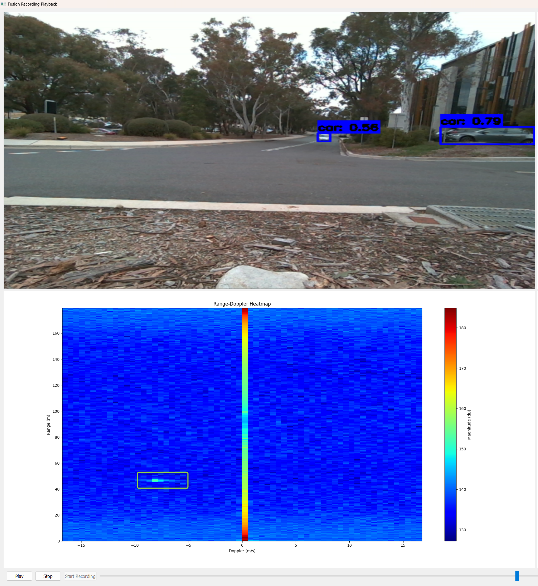
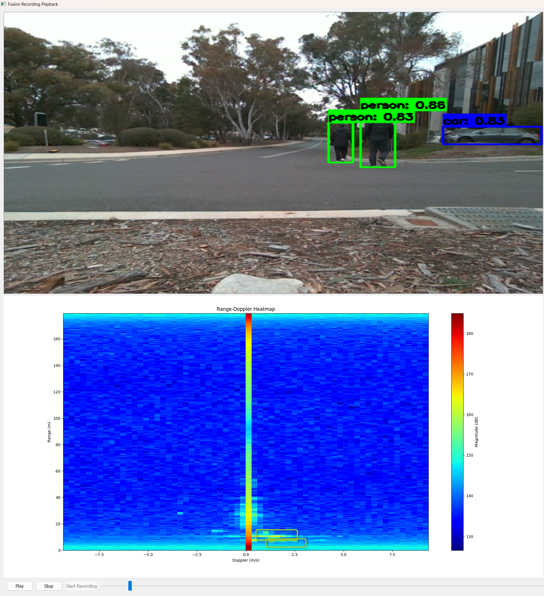
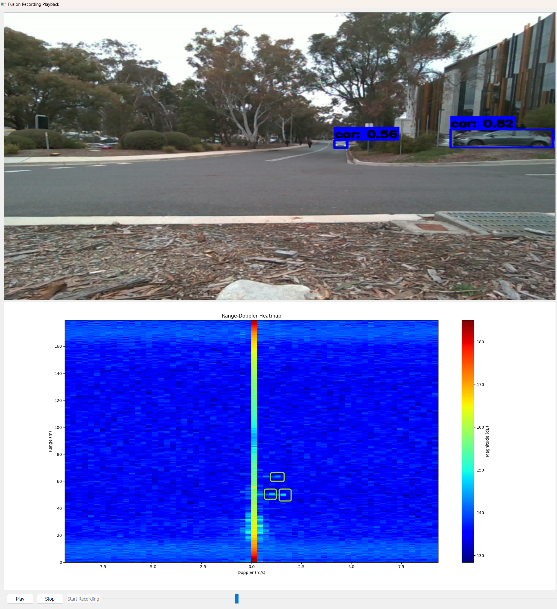
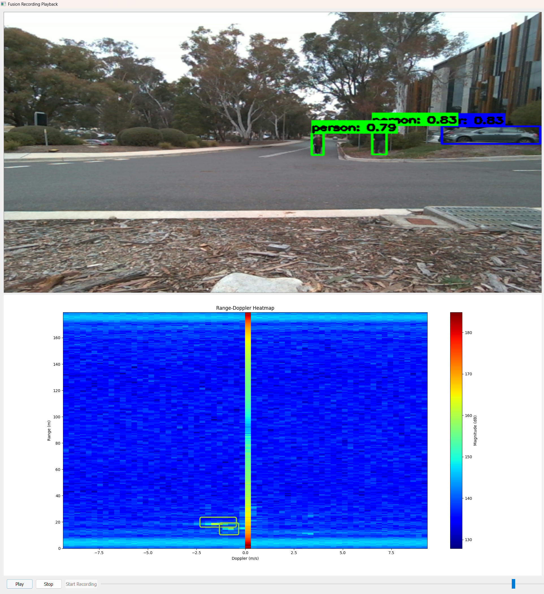

# Road Safety on Two Wheelers - FusionApp



## Overview
This application provides real-time object detection for road safety, specifically designed for two-wheeled vehicles. The system can detect cars, persons, and other objects to enhance rider safety.

## Sample Results

### Car Detection
|  |  |  |
|:---:|:---:|:---:|

### Person Detection
|  |  |  |
|:---:|:---:|:---:|
### 🎥 Radar and Camera based-detection Demo
<div align="center">
  <video src="demo/x.mp4" width="100%" controls muted loop poster="sensing_box.png">
    Your browser does not support the video tag. You can view the video directly at <a href="demo/x.mp4">demo/x.mp4</a>.
  </video>
</div>
## Features
- Real-time object detection for cars and pedestrians
- Works in various lighting conditions
- Alert system for potential collisions
- Compact sensing box design for two-wheeled vehicles

## Installation

### Prerequisites

- **Python**: 3.10 (validated on Windows 11 and x64 Linux). On NVIDIA Jetson platforms we have tested the pipelines on Python 3.8.
- **GPU**: NVIDIA CUDA-capable GPU on Windows/Ubuntu x64, or the integrated CUDA cores on NVIDIA Jetson devices (required for camera object detection at real-time rates).
  - **With GPU acceleration**: Full camera+radar fusion is available.
  - **Without GPU acceleration**: Disable video object detection or run radar-only mode for live streaming; CPU-only video inference is too slow for real time.
  - On Windows/Ubuntu x64 the video pipeline runs on PyTorch CUDA; on Jetson it runs on TensorRT (via the bundled `yolov8n.engine`). Ensure your toolchain matches the hardware.
- **Camera**: Intel RealSense D455 (optional, for camera fusion).
- **OS**: Windows 11, Ubuntu x64, and NVIDIA Ubuntu (Jetson) are officially supported.

### Installation Steps

#### 1. Install the inference toolchain

Choose the stack that matches your platform:

- **Windows / Ubuntu x64 with CUDA GPU** – install the PyTorch wheels built for your CUDA toolkit. Example for CUDA 12.4:
  ```bash
  pip install torch torchvision torchaudio --index-url https://download.pytorch.org/whl/cu124
  ```

- **CPU-only systems (radar-only mode)** – install the CPU wheels (camera object detection must be disabled for live streaming):
  ```bash
  pip install torch torchvision torchaudio --index-url https://download.pytorch.org/whl/cpu
  ```

- **NVIDIA Jetson** – use the JetPack image which already ships with CUDA, cuDNN, TensorRT, and the Python `tensorrt` bindings. PyTorch is not required for the camera pipeline; the analyser loads `models/video_analysis/yolov8n.engine` through TensorRT. Verify TensorRT is importable:
  ```bash
  python -c "import tensorrt as trt; print(trt.__version__)"
  ```

> CPU-only video analysis is not recommended. Disable video object detection and rely on radar-only mode if GPU acceleration is unavailable.

#### 2. Build and install `fpga_udp`

The fusion server streams live radar frames through the `fpga_udp` UDP interface. Follow the upstream instructions to build it:

```bash
git clone https://github.com/gaoweifan/pyRadar.git
cd pyRadar
# Build using the guidance in the repository's README (CMake + MSVC on Windows)
```

Install the resulting wheel/shared library into the active environment (e.g., `pip install <fpga_udp wheel>` or `pip install -e fpga_udp`).

#### 3. Install the remaining Python packages

```bash
pip install -r requirements.txt
```

#### 4. Build the K-Radar CUDA operators (manual step)

The sparse K-Radar pipeline depends on custom CUDA extensions found under `kradar/ops/`. These extensions are **not** installed by `requirements.txt` and must be compiled manually:

1. Linux/WSL: run `kradar/build_cuda_extensions.sh`. This helper script targets common CUDA toolchain layouts but may require edits for your distribution.
2. Native Windows: follow the setup instructions in `kradar/ops/README.md` (or inline comments) to compile each extension with MSVC + CUDA. The provided shell script does not officially support Windows.
3. Verify the resulting `.pyd`/`.so` files are importable (e.g., `python -c "from kradar.ops import sparse_pooling"`).

Without these extensions, `process_radar_kradar.py` and the related pipelines will fall back to slower CPU implementations or fail to import.

> **Platform notes:** The `requirements.txt` pins CUDA-enabled wheels (`cumm-cu124`, `spconv-cu124`, etc.) that match the reference Windows build used by the authors. Deployments on other operating systems or different hardware (including Jetson) may require alternative wheel versions or source builds. Treat the versions as guidance—align them with the PyTorch stack you installed (or TensorRT on Jetson, where PyTorch is optional).

### Troubleshooting

- **UDP timeout errors**: Usually caused by installing `fpga_udp` after other packages. Reinstall `fpga_udp` first in a fresh environment.
- **Performance issues**: Ensure GPU acceleration works.

## Usage

The application provides a **web-based interface** with two main modes: **Live** processing and **Replay** analysis.

### Starting the Fusion Server

Launch the web server to access the fusion application:

```bash
python fusion_server.py --host 127.0.0.1 --port 8081
```

Then open your browser and navigate to: `http://127.0.0.1:8081`

#### Command Line Arguments

- `--host`: Server host address (default: `127.0.0.1`)
- `--port`: Server port (default: `8081`)
- `--default-replay-path`: Default directory for replay mode (optional)
- `--default-replay-cfg`: Default radar config file for replay mode (optional)

**Example with replay defaults:**
```bash
python fusion_server.py --host 127.0.0.1 --port 8081 \
    --default-replay-path C:/recordings/2025_01_15/session_001 \
    --default-replay-cfg C:/recordings/2025_01_15/AWR2243_180m_70cm_64_3_512.txt
```

---

### Live Mode

Real-time synchronization, recording, and analysis of camera and radar data.

**Features:**
- Real-time object detection and tracking (person, car, bicycle, motorcycle, bus, truck)
- Simultaneous recording of radar and camera data
- Live visualization with 2D displays (video and radar heatmap)
- Automatic data synchronization
- Radar-only mode option (toggle in web interface)
- Configurable radar settings (range, resolution)
- Process status monitoring

**Controls:**
1. Select **Live** mode in the web interface
2. Choose radar configuration (e.g., "3D - 180m")
3. Enable/disable "Radar only" mode
4. Click **Start System** to initialize hardware
5. Click **Start Recording** to capture data
6. Adjust visualization frame rates (1-30 fps)

---

### Replay Mode

Synchronized replay and analysis of previously recorded data.

**Features:**
- Synchronized playback of recorded sessions
- Interactive playback controls (play, pause, step)
- Frame-by-frame analysis
- Support for custom radar configurations
- Video and radar visualization
- Adjustable playback speed

**Controls:**
1. Select **Replay** mode in the web interface
2. Enter recording directory path
3. Enter radar config file path
4. Enable/disable "Radar only" mode
5. Click **Start System** to load data
6. Use playback controls to navigate through recorded data
7. Adjust visualization frame rates (1-30 fps)

---

### System Requirements for Optimal Performance

- **Live Mode (30fps)**: NVIDIA GPU with CUDA support required for camera analysis
- **Live Mode (Radar-Only)**: Can run on CPU-only systems
- **Replay Mode**: GPU recommended but not required (video analysis disabled without CUDA)

---

## Additional Applications

The FusionApp includes several standalone applications for offline processing and analysis:

### 1. K-Radar Frame Processor (`process_radar_kradar.py`)

Process individual radar frames through the K-Radar pipeline to generate sparse point clouds and visualizations.

**Purpose**: Batch processing of radar data with full analysis artifacts (point clouds, heatmaps, tesseract cubes).

**Usage:**
```bash
python process_radar_kradar.py --bin-file <frame.bin> --config-file <config.txt> [options]
```

**Required Arguments:**
- `--bin-file`, `-b`: Path to radar frame file (.bin)
- `--config-file`, `-c`: Path to radar configuration file (.txt)

**Optional Arguments:**
- `--output-dir`, `-o`: Output directory for artifacts (default: same as input file)
- `--pipeline-config`: YAML pipeline configuration (default: `configs/default.yaml`)
- `--set`: Override config parameters (repeatable, e.g., `--set point_cloud.roi.x=[0,50]`)
- `--az-range MIN MAX`: Override azimuth range in degrees
- `--el-range MIN MAX`: Override elevation range in degrees

**Outputs:**
- Sparse point cloud (`.npy`)
- Point cloud visualizations (`.png`: XY and XZ views)
- Heatmap visualizations (`.png`: Range-Azimuth and Range-Elevation)
- ZYX cube (`.mat`)
- Tesseract 4D tensor (`.mat`)

**Example:**
```bash
python process_radar_kradar.py \
    --bin-file data/1234567890_12345_000000000001.bin \
    --config-file config_files/AWR2243_87m_17cm_64_3_256.txt \
    --output-dir results/
```

---

### 2. K-Radar Pretrained Inference (`process_radar_kradar_pretrained.py`)

Process radar data using pretrained K-Radar deep learning models for 3D object detection.

**Purpose**: Apply trained neural networks to radar frames for automatic object detection and classification.

**Usage:**
```bash
python process_radar_kradar_pretrained.py --config <model.yml> --checkpoint <weights.pt> \
    (--bin-file <frame.bin> | --bin-path <directory>) --config-file <config.txt> [options]
```

**Required Arguments:**
- `--config`: Path to model YAML config (e.g., `cp_KRADAR/configs/cfg_RTNH_wide.yml`)
- `--checkpoint`: Path to pretrained checkpoint (`.pt`)
- `--bin-file`, `-b`: Path to single .bin radar frame file (mutually exclusive with `--bin-path`)
- `--bin-path`, `-p`: Path to directory containing multiple .bin files (mutually exclusive with `--bin-file`)
- `--config-file`, `-c`: Path to radar configuration file (.txt)

**Optional Arguments:**
- `--conf-thr`: Confidence threshold for detections (default: model-specific)
- `--pipeline-config`: YAML pipeline configuration (default: `configs/default.yaml`)
- `--set`: Override pipeline config entries (repeatable)
- `--az-range MIN MAX`: Override azimuth range in degrees
- `--el-range MIN MAX`: Override elevation range in degrees
- `--output-json`: Path to save detection results as JSON
- `--no-artifacts`: Skip saving intermediate artifacts (point clouds, heatmaps)
- `--save-mat`: Save tesseract and zyx .mat files
- `--visualize`: Generate 3D visualization of point cloud with bounding boxes
- `--interactive`: Show interactive 3D viewer (blocks until closed, requires `--visualize`)
- `--view-angle {top,side,perspective,all}`: Camera view for saved images (default: perspective)

**Outputs:**
- Detection results (console and optional JSON)
- Bounding box visualizations (`.png`)
- Sparse point clouds (`.npy`, unless `--no-artifacts`)
- Heatmap visualizations (`.png`, unless `--no-artifacts`)
- 3D visualizations (`.png`, if `--visualize` enabled)
- MAT files (`.mat`, if `--save-mat` enabled)

**Example:**
```bash
python process_radar_kradar_pretrained.py \
    --config cp_KRADAR/configs/cfg_RTNH_wide.yml \
    --checkpoint checkpoints/rtnh_wide.pt \
    --bin-path data/session_001/ \
    --config-file config_files/AWR2243_180m_70cm_64_3_512.txt \
    --visualize --interactive
```

---

### 3. Detection Video Creator (`create_detection_video.py`)

Create synchronized videos combining camera frames with radar detection visualizations.

**Purpose**: Generate side-by-side videos showing camera view and perspective radar detection overlays for presentations or analysis.

**Usage:**
```bash
python create_detection_video.py --input-dir <directory> --output <video.mp4> [options]
```

**Required Arguments:**
- `--input-dir`: Directory containing camera frames and perspective detection PNGs
- `--output`: Path for output video file (e.g., `output.mp4`)

**Optional Arguments:**
- `--fps`: Frames per second for output video (default: 10)
- `--no-labels`: Don't add text labels to frames

**File Naming Convention:**
- Camera frames: `{timestamp_int}_{timestamp_frac}_{frame_number}.png`
  - Example: `0000000412_08863_000000000000.png`
- Perspective frames: `{timestamp_int}_{timestamp_frac}_{frame_number}_detection_vis_perspective.png`
  - Example: `0000000412_08863_000000000000_detection_vis_perspective.png`

**Outputs:**
- MP4 video with side-by-side camera and detection views
- Synchronized by timestamp
- Automatic frame interpolation for missing frames

**Example:**
```bash
python create_detection_video.py \
    --input-dir recordings/2025_01_15_10_30_00/ \
    --output session_001_detections.mp4 \
    --fps 15
```

---

## Configuration Files

### Pipeline Configurations (`configs/`)

- **`default.yaml`**: Standard processing pipeline with full analysis
  - Used by: `process_radar_kradar.py`, `process_radar_kradar_pretrained.py`
  - Features: Full CFAR detection, ROI filtering, power normalization

### Radar Hardware Configurations (`config_files/`)

Various AWR2243 radar configurations for different range/resolution tradeoffs:
- `AWR2243_10m_4cm_64_3_256.txt`: Short range (10m), high resolution (4cm)
- `AWR2243_87m_17cm_64_3_256.txt`: Medium range (87m), medium resolution (17cm)
- `AWR2243_180m_70cm_64_3_512.txt`: Long range (180m), lower resolution (70cm)

Select configuration based on application requirements (urban vs. highway scenarios).
