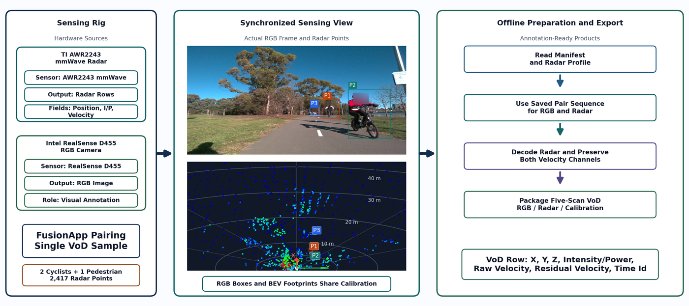
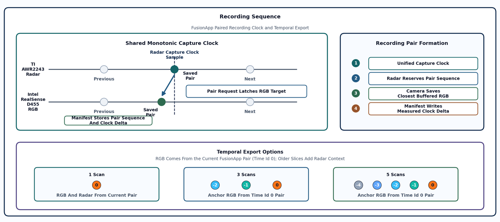
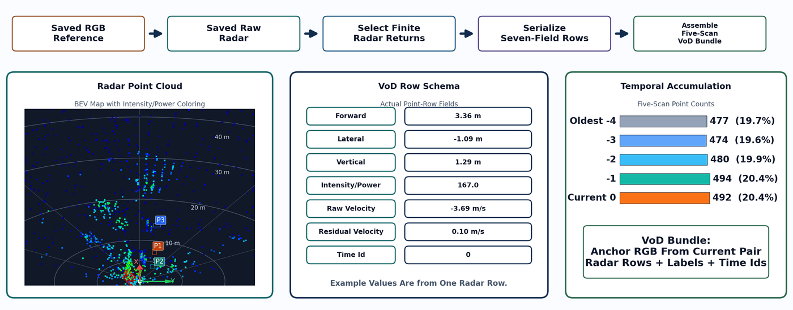
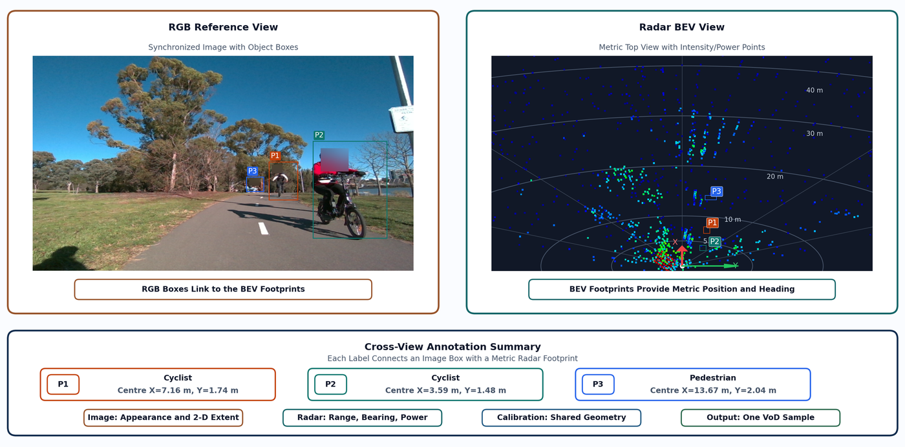
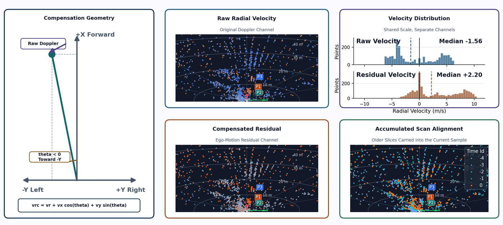
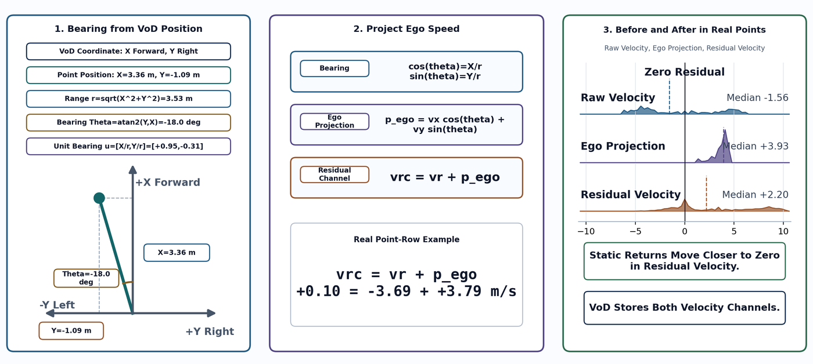

# VoD conversion (FusionApp)

Offline tools that turn a FusionApp recording (raw radar `.bin` + camera `.png`) into scan packs laid out like the [View-of-Delft (VoD)](https://intelligent-vehicles.org/datasets/view-of-delft/) dataset for annotation and AI training.

VoD follows a [KITTI](https://www.cvlibs.net/datasets/kitti/)-compatible folder and naming style (`image_2`, zero-based five-digit stems, shared calib ids). Official references:

- **KITTI Vision Benchmark Suite:** [https://www.cvlibs.net/datasets/kitti/](https://www.cvlibs.net/datasets/kitti/)
- **View-of-Delft (VoD):** [https://intelligent-vehicles.org/datasets/view-of-delft/](https://intelligent-vehicles.org/datasets/view-of-delft/)
- **VoD documentation / development kit:** [https://tudelft-iv.github.io/view-of-delft-dataset/](https://tudelft-iv.github.io/view-of-delft-dataset/)

These scripts reuse the same radar analyser, RGB pairing rules, and calibration files as the live FusionApp stack. You do not need the web UI or radar hardware to run them.

## Folder contents

| Path | Role |
|------|------|
| [`convert_raw_bin_to_vod.py`](./convert_raw_bin_to_vod.py) | Main converter: raw frames → `data/{1,3,5}_scan` |
| [`rebuild_scans_from_vod.py`](./rebuild_scans_from_vod.py) | Rebuild 1/3/5 packs from existing VoD clouds (e.g. after ego-motion changes) |
| [`export_5_scan_ranges.py`](./export_5_scan_ranges.py) | Split a `5_scan` pack into sequence ranges |
| [`sample_data/`](./sample_data/) | Sample recording (raw radar `.bin` + RGB `.png`) for testing the converter |
| [`figures/`](./figures/) | Pipeline diagrams (PNG counterparts of the `doc_14_july` vector figures) |

Run every command from the **FusionApp** root so `config_files/` and Python packages resolve.

## Quick start (data only)

By default the converter writes **only** the numbered scan datasets. Optional extras (`vod_pc`, PC-2D previews, range-Doppler, comparison grids) stay off unless you pass `--save-*`.

```powershell
cd E:\Twowheelers_18_5\RoadSafetyOnTwoWheelers-main\FusionApp

python vod_conversion\convert_raw_bin_to_vod.py `
  "E:\Twowheelers_18_5\recordings\YOUR_RECORDING_FOLDER" `
  --config "config_files\AWR2243_87m_17cm_64_3_256.txt" `
  --is-moving
```

Use the **exact** AWR2243 profile that recorded the session. Prefer `--is-moving` for road / moving-platform captures (ego-motion compensation). Add `--overwrite` if `data/` already exists.

### Try with the included sample data

[`sample_data/`](./sample_data/) is a ready-to-run FusionApp recording snippet (timestamped raw radar `.bin` frames paired with RGB `.png` images). Use it to verify VoD conversion without a full recording:

```powershell
cd E:\Twowheelers_18_5\RoadSafetyOnTwoWheelers-main\FusionApp

python vod_conversion\convert_raw_bin_to_vod.py `
  "vod_conversion\sample_data" `
  --config "config_files\AWR2243_87m_17cm_64_3_256.txt" `
  --is-moving `
  --overwrite
```

Output is written under `vod_conversion\sample_data\data\{1,3,5}_scan` with VoD/KITTI-style `image_2` and shared five-digit sample ids.

## Output layout

```text
YOUR_RECORDING_FOLDER/
  data/
    1_scan/
    3_scan/
    5_scan/
      image_2/00000.png
      radar/00000.bin
      radar_raw/00000.bin
      radarref/00000.csv
      calib/00000.txt
      manifest.csv
```

- Camera folder is VoD / KITTI-style **`image_2`**.
- Every paired file shares the **calib naming**: zero-based five-digit stem (`00000`, `00001`, …).
- `1_scan` / `3_scan` / `5_scan` are the same current RGB+calib frame with 1, 3, or 5 accumulated radar clouds.
- `manifest.csv` keeps 1-based `sequence` plus `sample_id` / `calib_source` matching the stem on disk.

## How this fits FusionApp

1. **Live recording** (FusionApp UI / DCA1000 + RealSense) stores timestamped raw radar bins and RGB frames.
2. **Synchronization** picks the latest readable camera image at or before each radar timestamp (same rule as `organize_recording_data`).
3. **This converter** runs the FusionApp radar analyser offline and writes VoD-compatible packs under `data/`.
4. **Annotation / training** consumes `image_2`, `radar`, and `calib` with shared sample ids.

---

## Pipeline

How FusionApp recording becomes VoD-style `data/{1,3,5}_scan` packs. Diagrams are the PNG counterparts of the vector figures in `doc_14_july/figures`, stored under [`figures/`](./figures/) so they render on GitHub.

### 1. End-to-end architecture

From live D455 RGB + AWR2243 radar capture through synchronization, offline conversion, and annotation-ready outputs.

<p align="center">
  
</p>

### 2. FusionApp synchronization

Radar-led pairing inside FusionApp: when a radar frame is saved, the corrected RGB buffer supplies the matching camera image for that sample.

<p align="center">
  
</p>

### 3. Raw radar to VoD conversion

`convert_raw_bin_to_vod.py` turns raw `.bin` frames into analyser detections and numbered `1` / `3` / `5` scan folders with a shared manifest.

<p align="center">
  
</p>

### 4. Pairing and annotation layout

Synchronized RGB and bird’s-eye radar view, and how calibrated footprints map onto the annotation contract (`image_2`, `radar`, `calib`).

<p align="center">
  
</p>

### 5. Velocity compensation on a moving platform

Why multi-scan stacks need ego-motion handling: compensated velocity and accumulation produce denser, consistent clouds when using `--is-moving`.

<p align="center">
  
</p>

### 6. Speed-compensation mechanism

Bearing, ego-velocity projection, and residual Doppler used to update `velocities_comp` during conversion with `--is-moving`.

<p align="center">
  
</p>

---

## Related scripts

**Rebuild scans from existing VoD clouds** (no MUSIC re-run):

```powershell
python vod_conversion\rebuild_scans_from_vod.py `
  "E:\Twowheelers_18_5\recordings\YOUR_RECORDING_FOLDER" `
  --is-moving `
  --overwrite
```

**Export sequence ranges from `5_scan`:**

```powershell
python vod_conversion\export_5_scan_ranges.py `
  "E:\Twowheelers_18_5\recordings\YOUR_RECORDING_FOLDER"
```

**Optional extras** on the main converter: `--save-vod-pc`, `--save-previews`, `--save-detections-csv`, `--save-range-doppler`, `--save-scan-comparison`.

## Calibration template

Default calib text copied into every sample:

`FusionApp/config_files/camera_radar_calib.txt`

Override with `--calib-template` if needed.
