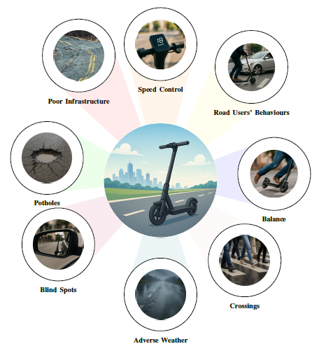

# Road Safety on Two Wheelers

This is the public repository for the road safety project at the University of Canberra 2025 - 2027

  

## Project Overview
[Your project description here]

## Features
- [Feature 1]
- [Feature 2]
- [Feature 3]

## Installation
[Installation instructions]

## Usage
[Usage instructions]

## Research Papers
**2025 Publications:**  
1. **"Towards Autonomous Riding: A Review of Perception, Planning, and Control in Intelligent Two-Wheelers"**  
   - *Authors*: [Mohammed Hassanin, Mohammad Abu Alsheikh, Carlos C. N. Kuhn, Damith Herath, Dinh Thai Hoang, Ibrahim Radwan]  
   - *Preprint*: 

## Team Members
1. Ibrahim Radwan
2. Javad Amiri
3. Mohammed Hassanin
4. Mohammad Abu Alsheikh
5. Carlos C. N. Kuhn
6. Damith Herath
7. Dinh Thai Hoang
8. Weijian Deng
