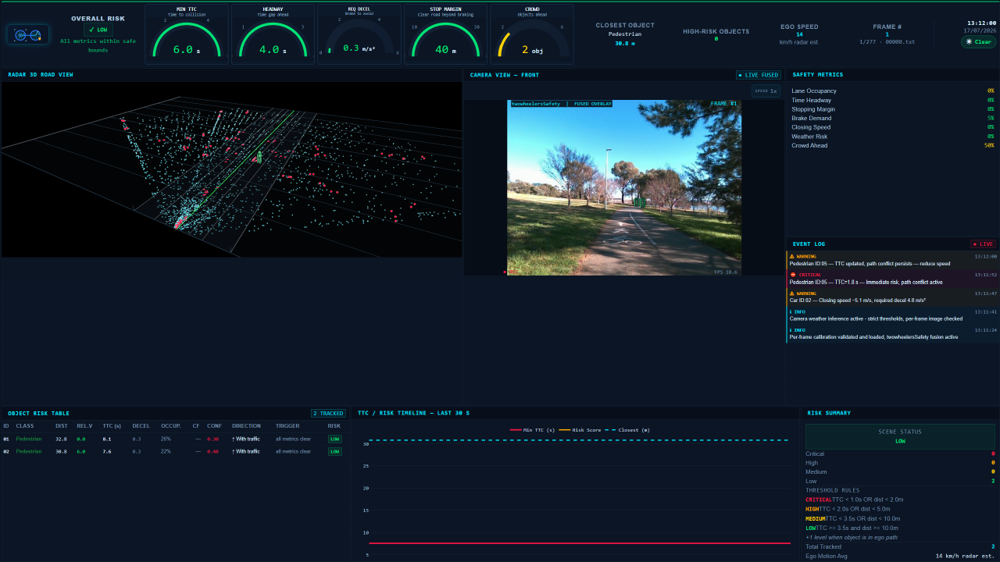

# Road Safety on Two Wheelers

Public repository for the road safety on two-wheelers research project at the University of Canberra (2025–2027).

<table>
  <tr>
    <td align="center" width="50%">
      <a href="https://github.com/ibrahim-radwan/RoadSafetyOnTwoWheelers/tree/main/FusionApp">
        
      </a>
      <br/>
      <a href="https://github.com/ibrahim-radwan/RoadSafetyOnTwoWheelers/tree/main/FusionApp"><b>FusionApp</b></a>
    </td>
    <td align="center" width="50%">
      <a href="https://github.com/ibrahim-radwan/RoadSafetyOnTwoWheelers/tree/main/FusionApp/vod_conversion">
        
      </a>
      <br/>
      <a href="https://github.com/ibrahim-radwan/RoadSafetyOnTwoWheelers/tree/main/FusionApp/vod_conversion"><b>VoD conversion</b></a>
    </td>
  </tr>
  <tr>
    <td align="center" width="50%">
      <a href="https://github.com/ibrahim-radwan/two-wheeler-radar-camera-annotation-tool">
        
      </a>
      <br/>
      <a href="https://github.com/ibrahim-radwan/two-wheeler-radar-camera-annotation-tool"><b>Annotation tool</b></a>
    </td>
    <td align="center" width="50%">
      <a href="https://github.com/ibrahim-radwan/twowheeler-safety-dashboard/tree/main">
        
      </a>
      <br/>
      <a href="https://github.com/ibrahim-radwan/twowheeler-safety-dashboard/tree/main"><b>Safety dashboard</b></a>
    </td>
  </tr>
</table>

## Components

| Component | Repository / path | Role |
|-----------|-------------------|------|
| **FusionApp** | [FusionApp](https://github.com/ibrahim-radwan/RoadSafetyOnTwoWheelers/tree/main/FusionApp) | Live and replay fusion of Intel RealSense D455 camera and TI AWR2243 / DCA1000 radar for two-wheeler road sensing (web UI via `fusion_server.py`) |
| **VoD conversion** | [FusionApp/vod_conversion](https://github.com/ibrahim-radwan/RoadSafetyOnTwoWheelers/tree/main/FusionApp/vod_conversion) | Offline conversion of recorded raw radar `.bin` + RGB `.png` into View-of-Delft (VoD) / KITTI-style `data/{1,3,5}_scan` packs for annotation and training |
| **Annotation tool** | [two-wheeler-radar-camera-annotation-tool](https://github.com/ibrahim-radwan/two-wheeler-radar-camera-annotation-tool) | Separate tool for labelling synchronised radar–camera data |
| **Safety dashboard** | [twowheeler-safety-dashboard](https://github.com/ibrahim-radwan/twowheeler-safety-dashboard/tree/main) | Separate dashboard for viewing and managing project safety / dataset outputs |

## Project overview

This project builds sensing and software for **road safety on two-wheeled vehicles**. The main codebase in this repository is **FusionApp**: a Python application that records and processes **camera + mmWave radar** on a compact sensing setup, with a browser interface for **live** capture and **replay** of recordings.

Recorded sessions (timestamped radar frames and RGB images) can be converted offline with **`vod_conversion`** into VoD-compatible folders (`image_2`, `radar`, `calib`, …) used for annotation and machine-learning work. Labelling and dashboarding live in related repositories linked above.

## Features

**FusionApp**
- Camera + radar fusion for detecting road users (e.g. cars, pedestrians) in live and replay modes
- Intel RealSense D455 and TI AWR2243 / DCA1000 recording and streaming
- Web UI (`fusion_server.py`) for live sensing and recorded-session replay
- Shared radar–camera timing for paired recording (monotonic capture clock / pair sequence)
- Optional GPU-accelerated camera detection; radar-only operation when video GPU is unavailable
- Support for Windows 11, Ubuntu x64, and NVIDIA Jetson (see `FusionApp/README.md`)

**VoD conversion (`FusionApp/vod_conversion`)**
- Offline raw `.bin` + `.png` → VoD/KITTI-style `1_scan` / `3_scan` / `5_scan` datasets
- Optional ego-motion compensation (`--is-moving`) for moving-platform multi-scan stacks
- Sample data and pipeline documentation under `vod_conversion/`

**Related tools (linked repositories)**
- Radar–camera annotation interface for labelled datasets
- Safety dashboard for project visualisation / overview

## Installation

See [FusionApp/README.md](FusionApp/README.md) for Python, CUDA/Jetson, `fpga_udp`, and dependency setup.

## Usage

```bash
cd FusionApp
python fusion_server.py --host 127.0.0.1 --port 8081
```

Open `http://127.0.0.1:8081`. For offline VoD packs, see [FusionApp/vod_conversion/README.md](FusionApp/vod_conversion/README.md).

## Research papers

**Publications:**
1. Hassanin, M., Alsheikh, M.A., Kuhn, C.C., Herath, D., Hoang, D.T. and Radwan, I., 2025. Towards Autonomous Riding: A Review of Perception, Planning, and Control in Intelligent Two-Wheelers. arXiv preprint arXiv:2507.11852.
   - https://arxiv.org/pdf/2507.11852
2. Deng, W., Tu, W., Radwan, I., Alsheikh, M.A., Gould, S. and Zheng, L., 2025. Confidence and Dispersity as Signals: Unsupervised Model Evaluation and Ranking. arXiv preprint arXiv:2510.02956.
   - https://arxiv.org/pdf/2510.02956

## Team members

1. Ibrahim Radwan  
2. Javad Amiri  
3. Mohammed Hassanin  
4. Mohammad Abu Alsheikh  
5. Carlos C. N. Kuhn  
6. Damith Herath  
7. Dinh Thai Hoang  
8. Weijian Deng  
9. Wael Issa  
