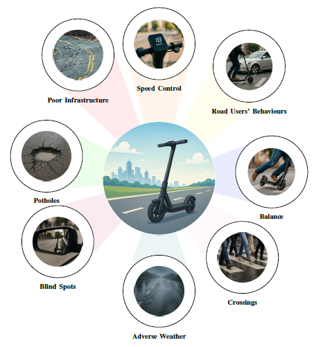

# Road Safety on Two Wheelers

This is the public repository for the road safety project at the University of Canberra 2025 - 2027

  

## Project Overview
TBA

## Features
- ...

## Installation
[TBA]

## Usage
[TBA]

## Research Papers
**Publications:**  
1. Hassanin, M., Alsheikh, M.A., Kuhn, C.C., Herath, D., Hoang, D.T. and Radwan, I., 2025. Towards Autonomous Riding: A Review of Perception, Planning, and Control in Intelligent Two-Wheelers. arXiv preprint arXiv:2507.11852.
   - Link: https://arxiv.org/pdf/2507.11852 
3. Deng, W., Tu, W., Radwan, I., Alsheikh, M.A., Gould, S. and Zheng, L., 2025. Confidence and Dispersity as Signals: Unsupervised Model Evaluation and Ranking. arXiv preprint arXiv:2510.02956.
   - Link: https://arxiv.org/pdf/2510.02956?
## Team Members
1. Ibrahim Radwan
2. Javad Amiri
3. Mohammed Hassanin
4. Mohammad Abu Alsheikh
5. Carlos C. N. Kuhn
6. Damith Herath
7. Dinh Thai Hoang
8. Weijian Deng
9. Wael Issa
