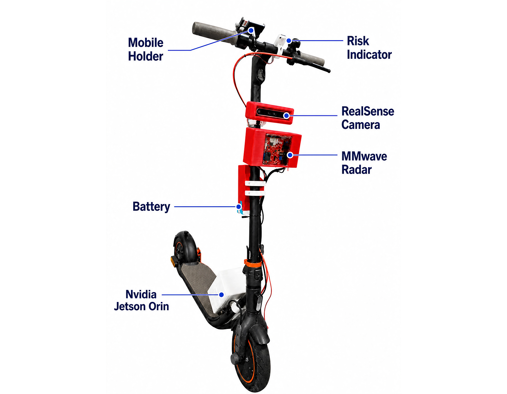
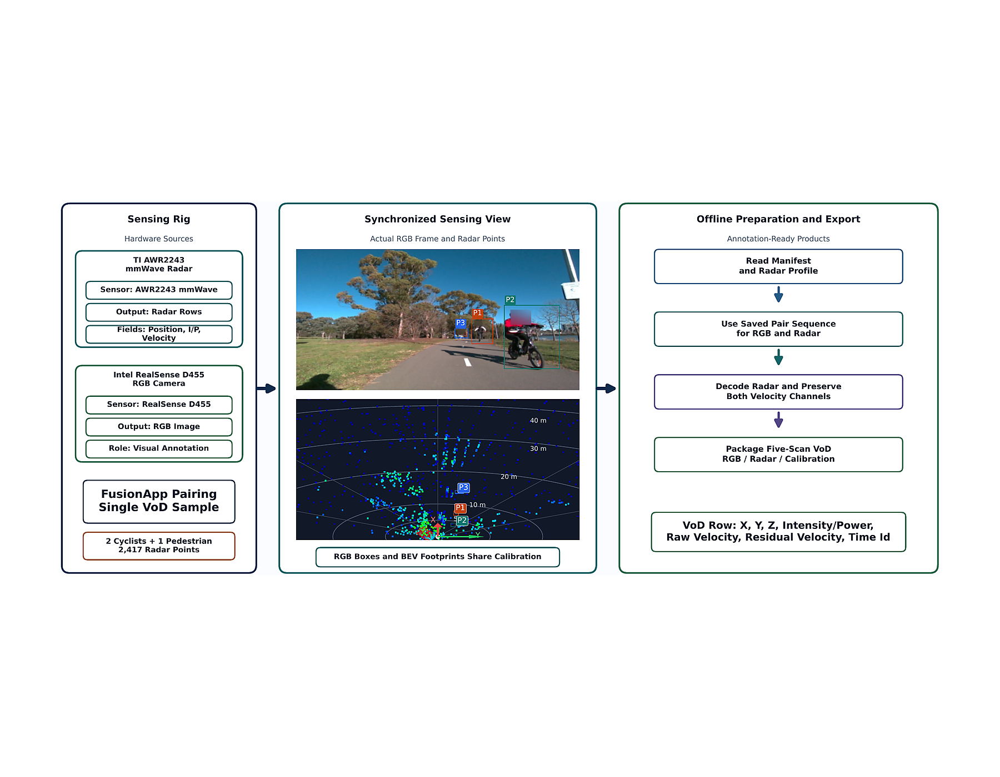
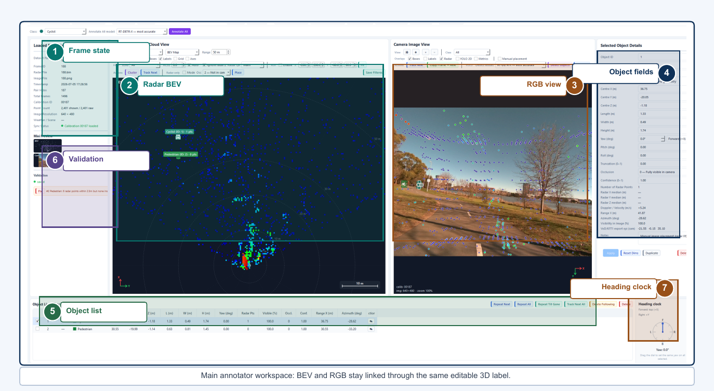
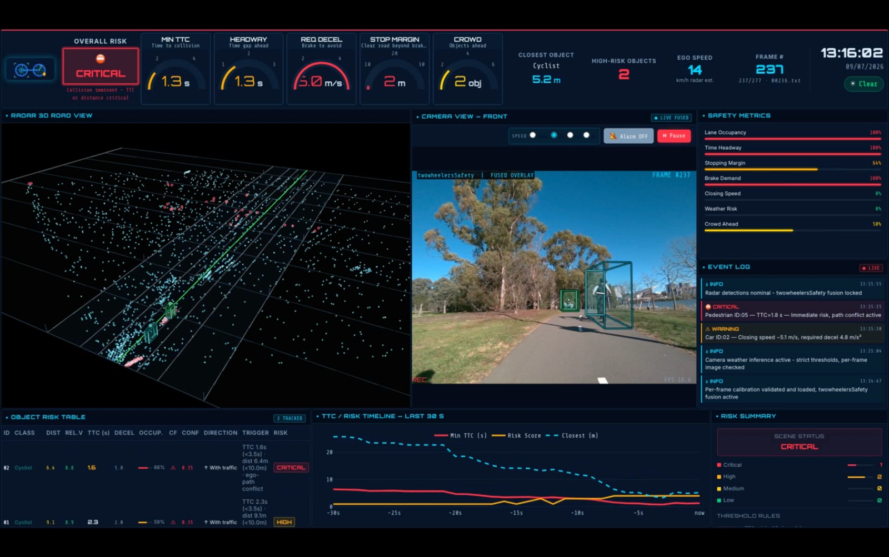

# Road Safety on Two Wheelers

Public repository for the road safety on two-wheelers research project at the University of Canberra (2025–2027).

<table>
  <tr>
    <td align="center" valign="bottom" width="50%">
      <a href="https://github.com/ibrahim-radwan/RoadSafetyOnTwoWheelers/tree/main/FusionApp">
        
      </a>
      <br/>
      <a href="https://github.com/ibrahim-radwan/RoadSafetyOnTwoWheelers/tree/main/FusionApp"><b>FusionApp</b></a>
    </td>
    <td align="center" valign="bottom" width="50%">
      <a href="https://github.com/ibrahim-radwan/RoadSafetyOnTwoWheelers/tree/main/FusionApp/vod_conversion">
        
      </a>
      <br/>
      <a href="https://github.com/ibrahim-radwan/RoadSafetyOnTwoWheelers/tree/main/FusionApp/vod_conversion"><b>VoD conversion</b></a>
    </td>
  </tr>
  <tr>
    <td align="center" valign="bottom" width="50%">
      <a href="https://github.com/ibrahim-radwan/two-wheeler-radar-camera-annotation-tool">
        
      </a>
      <br/>
      <a href="https://github.com/ibrahim-radwan/two-wheeler-radar-camera-annotation-tool"><b>Annotation tool</b></a>
    </td>
    <td align="center" valign="bottom" width="50%">
      <a href="https://github.com/ibrahim-radwan/twowheeler-safety-dashboard/tree/main">
        
      </a>
      <br/>
      <a href="https://github.com/ibrahim-radwan/twowheeler-safety-dashboard/tree/main"><b>Safety dashboard</b></a>
    </td>
  </tr>
</table>

## Components

| Component | Repository / path | Role |
|-----------|-------------------|------|
| **FusionApp** | [FusionApp](https://github.com/ibrahim-radwan/RoadSafetyOnTwoWheelers/tree/main/FusionApp) | Real-time camera + mmWave radar sensing and object detection on the two-wheeler (RealSense D455, AWR2243/DCA1000); live streaming, paired recording, and replay through the web UI (`fusion_server.py`) |
| **VoD conversion** | [FusionApp/vod_conversion](https://github.com/ibrahim-radwan/RoadSafetyOnTwoWheelers/tree/main/FusionApp/vod_conversion) | Offline tools that rebuild FusionApp recordings (raw radar `.bin` + RGB `.png`) into [VoD](https://intelligent-vehicles.org/datasets/view-of-delft/) / [KITTI](https://www.cvlibs.net/datasets/kitti/)-style `data/{1,3,5}_scan` packs (`image_2`, `radar`, `calib`, …) for annotation and training |
| **Annotation tool** | [two-wheeler-radar-camera-annotation-tool](https://github.com/ibrahim-radwan/two-wheeler-radar-camera-annotation-tool) | Easy-to-use desktop app (Qt) for fast radar–camera data annotation: draw and review 3D ground-truth boxes on synchronised BEV + RGB, with optional Doppler and track IDs; import/export VoD/KITTI `label_2` plus JSON/CSV |
| **Safety dashboard** | [twowheeler-safety-dashboard](https://github.com/ibrahim-radwan/twowheeler-safety-dashboard/tree/main) | Browser dashboard (Dash/Plotly) that plays a KITTI-style camera + radar sequence, tracks nearby road users, and shows live risk metrics (e.g. TTC, brake demand, crowding) with optional alerts |

## Project overview

This project develops sensing and software for **road safety on two-wheeled vehicles**. Work in this repository centres on **FusionApp**: camera + mmWave radar capture, live fusion, and recording.

Offline **VoD conversion** turns those recordings into datasets that match the [View-of-Delft (VoD)](https://intelligent-vehicles.org/datasets/view-of-delft/) folder layout. VoD uses the same style as [KITTI](https://www.cvlibs.net/datasets/kitti/) (`image_2`, five-digit file names, shared calibration ids), so the packs work with common annotation and training tools. Official VoD docs and development kit: [tudelft-iv.github.io/view-of-delft-dataset](https://tudelft-iv.github.io/view-of-delft-dataset/).

Labelling is done with the [radar–camera annotation tool](https://github.com/ibrahim-radwan/two-wheeler-radar-camera-annotation-tool). Results and datasets can be viewed in the [two-wheeler safety dashboard](https://github.com/ibrahim-radwan/twowheeler-safety-dashboard/tree/main).

## Features

End-to-end pipeline, from hardware to dashboard:

1. **Hardware setup** — Compact two-wheeler sensing box with Intel RealSense D455 (RGB) and TI AWR2243 radar via DCA1000; FusionApp talks to the radar through `fpga_udp` (see [FusionApp](https://github.com/ibrahim-radwan/RoadSafetyOnTwoWheelers/tree/main/FusionApp)).
2. **Live sensing & recording** — [FusionApp](https://github.com/ibrahim-radwan/RoadSafetyOnTwoWheelers/tree/main/FusionApp) web UI (`fusion_server.py`) for live camera + radar, optional GPU camera detection, and paired radar–camera recording with a shared capture clock.
3. **Replay** — Same UI replays recorded sessions for offline review without hardware.
4. **VoD conversion** — [`vod_conversion`](https://github.com/ibrahim-radwan/RoadSafetyOnTwoWheelers/tree/main/FusionApp/vod_conversion) converts raw `.bin` + `.png` into VoD / KITTI-style `1_scan` / `3_scan` / `5_scan` packs (`image_2`, `radar`, `radar_raw`, `calib`); optional `--is-moving` ego-motion compensation. Dataset references: [VoD](https://intelligent-vehicles.org/datasets/view-of-delft/), [KITTI](https://www.cvlibs.net/datasets/kitti/).
5. **Annotation** — Label synchronised radar–camera samples with the [two-wheeler radar–camera annotation tool](https://github.com/ibrahim-radwan/two-wheeler-radar-camera-annotation-tool).
6. **Dashboard** — Inspect and present project / safety outputs in the [two-wheeler safety dashboard](https://github.com/ibrahim-radwan/twowheeler-safety-dashboard/tree/main).

## Installation

See [FusionApp/README.md](FusionApp/README.md) for Python, CUDA/Jetson, `fpga_udp`, and dependency setup.

## Usage

```bash
cd FusionApp
python fusion_server.py --host 127.0.0.1 --port 8081
```

Open `http://127.0.0.1:8081`. For offline VoD packs, see [FusionApp/vod_conversion/README.md](FusionApp/vod_conversion/README.md).

## Research papers

**Publications:**
1. Hassanin, M., Alsheikh, M.A., Kuhn, C.C., Herath, D., Hoang, D.T. and Radwan, I., 2025. Towards Autonomous Riding: A Review of Perception, Planning, and Control in Intelligent Two-Wheelers. arXiv preprint arXiv:2507.11852.
   - https://arxiv.org/pdf/2507.11852
2. Deng, W., Tu, W., Radwan, I., Alsheikh, M.A., Gould, S. and Zheng, L., 2025. Confidence and Dispersity as Signals: Unsupervised Model Evaluation and Ranking. arXiv preprint arXiv:2510.02956.
   - https://arxiv.org/pdf/2510.02956

## Team members

<table width="100%">
  <tr>
    <td width="33%">Ibrahim&nbsp;Radwan</td>
    <td width="34%">Wael&nbsp;Issa</td>
    <td width="33%">Mohammad&nbsp;Abu&nbsp;Alsheikh</td>
  </tr>
  <tr>
    <td>Dinh&nbsp;Thai&nbsp;Hoang</td>
    <td>Javad&nbsp;Amiri</td>
    <td>Carlos&nbsp;C.&nbsp;N.&nbsp;Kuhn</td>
  </tr>
  <tr>
    <td>Weijian&nbsp;Deng</td>
    <td>Mohammed&nbsp;Hassanin</td>
    <td>Mohammed&nbsp;Alotaibi</td>
  </tr>
  <tr>
    <td>Damith&nbsp;Herath</td>
    <td></td>
    <td></td>
  </tr>
</table>
